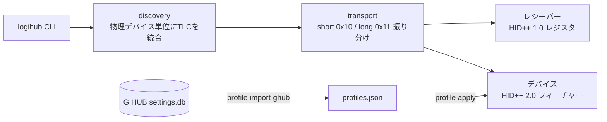

<div align="center">

# better-logihub

### Logicool G HUB の実用機能だけを 3MB の CLI にした Windows 用ツール

[](Cargo.toml)
[](#インストール)
[](LICENSE)

**Electron 201MB + 常駐エージェント 84MB は要らない。マウス設定は HID++ を直接叩けば終わる。**

---

</div>

## 概要

Logicool G HUB は DPI とポーリングレートを変えるためだけに 1.4GB のディスクと複数の常駐プロセスを要求します。better-logihub は G HUB が内部で使っているのと同じ公開解析済みプロトコル (HID++ 1.0 / 2.0) をレシーバーに直接話しかけることで、同じ操作を単体の CLI バイナリで行います。常駐なし、Electron なし、管理者権限なし。

G HUB の設定データベースからプロファイル (DPI テーブル・レポートレート) を取り込めるので、G HUB をアンインストールしても設定は引き継げます。

## 特徴

| 機能 | コマンド | 対応フィーチャー |
|---|---|---|
| デバイス列挙 (レシーバー+ペアリング先) | `logihub list` | HID++ 1.0 レジスタ 0xB5 |
| バッテリー残量・充電状態 | `logihub battery` | 0x1004 / 0x1000 |
| DPI 取得・設定 | `logihub dpi get` / `dpi set 3200` | 0x2202 / 0x2201 |
| レポートレート取得・設定 | `logihub rate get` / `rate set 1000` | 0x8061 / 0x8060 |
| フィーチャーテーブル dump | `logihub features` | 0x0001 |
| G HUB プロファイル移行 | `logihub profile import-ghub` | settings.db (SQLite) |
| プロファイル適用 | `logihub profile apply Desktop` | — |
| オンボードボタン割り当て | `logihub buttons set 7 key:ctrl+c` | 0x8100 |
| オンボード DPI テーブル / レート | `logihub onboard set-dpi` / `set-rate` | 0x8100 |
| アクティブ DPI スロット固定 | `logihub onboard set-dpi-index 3` | 0x8100 |
| オンボードメモリの dump / restore | `logihub onboard dump` / `restore` | 0x8100 |

- 全コマンド `--json` で JSON 出力対応
- Unifying / LIGHTSPEED / Bolt 各レシーバーと有線直結デバイスに対応する設計
- Windows の HID コレクション分割 (short/long TLC) を正しく処理

## 処理フロー



## インストール

```bash
cargo build --release
# → target/release/logihub.exe (単体バイナリ、コピーするだけで動く)
```

## 使い方

```bash
# 接続デバイス一覧
logihub list

# バッテリー確認
logihub battery

# DPI を 3200 に (デバイスが複数あるときは --device <番号>)
logihub dpi set 3200 --device 1

# G HUB から設定を移行してから適用
logihub profile import-ghub
logihub profile apply Desktop --device 1

# ボタンにショートカットを割り当て (マウス本体のメモリに書くので常駐ソフト不要)
logihub onboard dump --out backup.bin --device 1   # 書き込み前のバックアップ (必須)
logihub buttons set 7 key:ctrl+c --device 1
logihub buttons set 11 key:win+l --device 1
logihub buttons list --device 1

# DPI テーブルとレートもオンボード化 (電源を切っても残る)
logihub onboard set-dpi 800 1200 1600 4000 7000 --default 3 --shift 800 --device 1
logihub onboard set-rate 1000 --device 1
logihub onboard set-dpi-index 3 --device 1   # 今使うスロットを指定
```

プロファイルは `%APPDATA%\better-logihub\profiles.json` に保存されます。

## 制限事項

- ボタン割り当てはオンボードメモリ書き込みで対応 (`buttons set`)。キーストローク・マウスボタン・DPI 操作を割り当て可能。マクロ・ライティングは対象外
- オンボード書き込みは毎回「事前バックアップ必須 → CRC 検証 → 書き込み → 読み戻し照合」を通ります。壊れたら `onboard restore` で戻せます
- 電源オフ / スリープ中の無線デバイスは `unreachable` と表示されます (レシーバーの仕様)

## 参考

HID++ プロトコルの公開解析情報 ([Solaar](https://github.com/pwr-Solaar/Solaar)、Linux カーネル `hid-logitech-hidpp`) を参照しています。

## ライセンス

[MIT](LICENSE)
