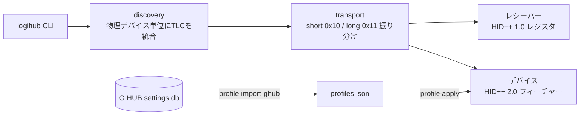

<div align="center">

# better-logihub

### Logicool G HUB の実用機能だけを 3MB の CLI にした Windows 用ツール

[](Cargo.toml)
[](#インストール)
[](LICENSE)

**Electron 201MB + 常駐エージェント 84MB は要らない。マウス設定は HID++ を直接叩けば終わる。**

---

</div>

## 概要

Logicool G HUB は DPI とポーリングレートを変えるためだけに 1.4GB のディスクと複数の常駐プロセスを要求します。better-logihub は G HUB が内部で使っているのと同じ公開解析済みプロトコル (HID++ 1.0 / 2.0) をレシーバーに直接話しかけることで、同じ操作を単体の CLI バイナリで行います。常駐なし、Electron なし、管理者権限なし。

G HUB の設定データベースからプロファイル (DPI テーブル・レポートレート) を取り込めるので、G HUB をアンインストールしても設定は引き継げます。

## 特徴

| 機能 | コマンド | 対応フィーチャー |
|---|---|---|
| デバイス列挙・モデル識別 (レシーバー+ペアリング先) | `logihub list` | HID++ 1.0 レジスタ 0xB5 + 内蔵デバイス表 |
| モデル情報・ライブ機能一覧 | `logihub device-info --device 3` | 内蔵デバイス表 + 0x0001 |
| バッテリー残量・充電状態 | `logihub battery` | 0x1004 / 0x1000 |
| DPI 取得・設定 | `logihub dpi get` / `dpi set 3200` | 0x2202 / 0x2201 |
| レポートレート取得・設定 | `logihub rate get` / `rate set 1000` | 0x8061 / 0x8060 |
| フィーチャーテーブル dump | `logihub features` | 0x0001 |
| 明るさの取得・設定 | `logihub brightness` / `brightness set 50` | 0x8040 |
| ファームウェア RGB エフェクト | `logihub rgb info` / `rgb set ...` | 0x8071 |
| キー単位 RGB フレーム | `logihub perkey set a=FF0000 ...` | 0x8081 |
| G キー情報・software mode | `logihub gkeys info` / `gkeys software-mode on` | 0x8010 |
| M1/M2/M3・MR LED | `logihub mkeys set m1` / `mr on` | 0x8020 / 0x8030 |
| 特殊キー一覧・divert・remap | `logihub keys list` / `keys divert ...` | 0x1B04 |
| HID++ 入力イベント監視 | `logihub watch --device 3` | 0x8010 / 0x8020 / 0x8030 / 0x1B04 |
| G キー・特殊キー常駐割り当て | `logihub daemon` | HID++ 通知 + Windows SendInput |
| G HUB プロファイル移行 | `logihub profile import-ghub` | settings.db (SQLite) |
| プロファイル適用 | `logihub profile apply Desktop` | — |
| オンボードボタン割り当て | `logihub buttons set 7 key:ctrl+c` | 0x8100 |
| オンボード DPI テーブル / レート | `logihub onboard set-dpi` / `set-rate` | 0x8100 |
| アクティブ DPI スロット固定 | `logihub onboard set-dpi-index 3` | 0x8100 |
| オンボードメモリの dump / restore | `logihub onboard dump` / `restore` | 0x8100 |
| オンボード名の取得・設定 | `logihub onboard get-name` / `set-name` | 0x8100 |
| セクター CRC 取得・保存済みマクロ実行 | `logihub onboard crc` / `exec-macro` | 0x8100 |

- 全コマンド `--json` で JSON 出力対応
- Unifying / LIGHTSPEED / Bolt 各レシーバーと有線直結デバイスに対応する設計
- Windows の HID コレクション分割 (short/long TLC) を正しく処理
- HID++ 2.0 software id は 1〜15 から選び、他ソフトとの衝突を検出すると自動で切り替え

## 処理フロー


```mermaid
flowchart LR
    CLI[logihub CLI] --> D[discovery<br>物理デバイス単位にTLCを統合]
    D --> T[transport<br>short 0x10 / long 0x11 振り分け]
    T --> R[レシーバー<br>HID++ 1.0 レジスタ]
    T --> Dev[デバイス<br>HID++ 2.0 フィーチャー]
    G[(G HUB settings.db)] -->|profile import-ghub| P[profiles.json]
    P -->|profile apply| Dev
```

## インストール

```bash
cargo build --release
# → target/release/logihub.exe (単体バイナリ、コピーするだけで動く)
```

## 使い方

```bash
# 接続デバイス一覧
logihub list
logihub list --json

# 内蔵モデル情報と、実機が現在広告している HID++ 機能
logihub device-info --device 3

# バッテリー確認
logihub battery

# DPI を 3200 に (デバイスが複数あるときは --device <番号>)
logihub dpi set 3200 --device 1

# G HUB から設定を移行してから適用
logihub profile import-ghub
logihub profile apply Desktop --device 1

# キーボードの明るさ (割合またはデバイス生値)
logihub brightness --device 3
logihub brightness set 50 --device 3
logihub brightness set raw 500 --device 3

# 対応ゾーン・エフェクト・NV capability・電源モードを表示
logihub rgb info --device 3

# RAM だけに固定色を書き、消灯する (NVM は --persist nvm)
logihub rgb set --zone 0 --effect fixed --color 00FF40 --persist ram --device 3
logihub rgb set --zone all --effect colorwave --period 5000 --direction horizontal --device 3
logihub rgb off --zone all --device 3

# RGB 電源モード。数値の意味は機種依存なので生値として扱う
logihub rgb power --device 3
logihub rgb power set 1 --device 3

# NV 設定の生読み書き (item は 0x0001 等、値は 7 byte)
logihub rgb nv get 0x0001 --device 3
logihub rgb nv set 0x0001 01 00 FF 40 00 00 00 --device 3

# キー単位の色。zone-id の実機確認前は番号方式を必ず明示する
logihub perkey set a=FF0000 b=00FF00 --zone-scheme hidusage --device 3
logihub perkey fill 202020 --zone-scheme hidusage --device 3
logihub perkey frame --from frame.json --zone-scheme hidusage --device 3
logihub perkey clear --zone-scheme hidusage --device 3

# A/B キーに候補ごとの色を書き、観察結果を入力する。方式は自動決定しない
logihub perkey probe --device 3

# G キー数と getPhysicalLayout の raw BE16 値
logihub gkeys info --device 3

# software mode 中は通常の F キー出力が止まる。確認後は必ず off に戻す
logihub gkeys software-mode on --device 3
logihub watch --device 3
logihub gkeys software-mode off --device 3

# M キーと MR の LED
logihub mkeys set m1 --device 3
logihub mkeys set none --device 3
logihub mr on --device 3
logihub mr off --device 3

# reprogrammable control の CID、task、capability、現在の reporting 状態
logihub keys list --device 3
logihub keys list --device 1

# 一時 divert。--persist はデバイスの永続設定を変更するので通常は付けない
logihub keys divert play-pause on --device 3
logihub keys divert play-pause off --device 3
logihub keys divert 0x00c3 on --raw-xy on --device 1
logihub keys divert 0x00c3 off --raw-xy off --device 1

# source CID を target CID の native task へ一時 remap。group/gmask を検証してから送る
logihub keys remap 0x0053 0x0056 --device 1

# 全 CID reporting 設定をファームウェア既定へ戻す
logihub keys reset --device 1

# ボタンにショートカットを割り当て (マウス本体のメモリに書くので常駐ソフト不要)
logihub onboard dump --out backup.bin --device 1   # 書き込み前のバックアップ (必須)
logihub buttons set 7 key:ctrl+c --device 1
logihub buttons set 11 key:win+l --device 1
logihub buttons list --device 1

# DPI テーブルとレートもオンボード化 (電源を切っても残る)
logihub onboard set-dpi 800 1200 1600 4000 7000 --default 3 --shift 800 --device 1
logihub onboard set-rate 1000 --device 1
logihub onboard set-dpi-index 3 --device 1   # 今使うスロットを指定

# 最初の有効プロファイル名と、セクター CRC を読み取る
logihub onboard get-name --device 1
logihub onboard crc 1 --device 1             # 0x0101 のような 16 進数も可

# プロファイル名を書き換える (事前 dump 必須)
logihub onboard set-name "Desktop" --device 1

# 保存済みオンボードマクロを指定位置から実行
logihub onboard exec-macro 6 0 --device 1
```

プロファイルは `%APPDATA%\better-logihub\profiles.json` に保存されます。

## 常駐割り当て

`logihub daemon` は `%APPDATA%\better-logihub\bindings.json` を読みます。ファイルがなければ安全な例を作成して終了するので、編集後にもう一度起動してください。`--config <path>` で別のファイルも指定できます。

```json
{
  "devices": {
    "g915": {
      "gkeys": {
        "g1": { "keys": "ctrl+shift+c" },
        "g2": { "text": "定型文" },
        "g3": { "run": "C:\\Tools\\app.exe --flag" },
        "g4": {
          "macro": [
            { "keys": "ctrl+l" },
            { "delay_ms": 50 },
            { "text": "https://example.com" },
            { "keys": "enter" }
          ]
        },
        "g5": { "none": true }
      },
      "cids": {
        "play-pause": { "keys": "media-play-pause" }
      }
    },
    "0x409f": {
      "gkeys": {},
      "cids": {
        "gesture-navigation": { "keys": "win+tab" }
      }
    }
  }
}
```

デバイスキーは内蔵データの `model_id` または `0x` 付き PID です。CID は `keys list` に出る数値または名前を指定します。`keys` は `ctrl` / `shift` / `alt` / `win`、英数字、F1〜F24、Enter、Esc、Tab、Space、矢印、再生・曲送り・音量系メディアキーに対応します。`run` は `cmd.exe /D /S /C` で起動します。

入力は held mask の変化から判定し、押下 edge で一度だけ action を実行、release edge は状態だけ更新します。キーリピートは行いません。Ctrl+C、Ctrl+Break、コンソール close/logoff/shutdown 時には G-key software mode を off、daemon が divert した CID を non-persistent な通常入力へ戻します。0x1D4B の再構成/電源投入通知では割り当てを再適用します。

```bash
logihub daemon
logihub daemon --config C:\path\bindings.json --verbose
```

`watch --json` はイベントごとに 1 JSON object を1行で出力します。daemon の `--verbose` は decoded event に加えて raw HID++ frame を stdout に記録します。

## 制限事項

- ボタン割り当てはオンボードメモリ書き込みで対応 (`buttons set`)。キーストローク・マウスボタン・特殊操作・既存マクロ参照を割り当て可能。マクロ作成は対象外
- `rgb set` の既定は RAM (`--persist ram`)。`nvm` と `powersave` は不揮発領域へ書くため、意図した場合だけ指定してください
- 0x8081 の zone-id は機種ごとに HID usage 方式と Solaar 方式の候補があります。`data/devices.json` に `zone_scheme` がない機種では `--zone-scheme hidusage|solaar` が必須です。`perkey probe` は観察結果を表示するだけで自動保存・自動判定しません
- `perkey frame --from` は `{"a":"FF0000","esc":"00FF00"}` 形式です。`--persist` を付けない限り RAM フレームだけを書きます
- オンボード書き込みは毎回「事前バックアップ必須 → CRC 検証 → 書き込み → 読み戻し照合」を通ります。壊れたら `onboard restore` で戻せます
- 電源オフ / スリープ中の無線デバイスは `unreachable` と表示されます (レシーバーの仕様)
- `gkeys info` の physical layout は仕様上「layout id」か「物理 G-key bitmask」か未確定のため、解釈せず raw BE16 として表示します
- `bindings.json` は標準の press/release edge と単純 macro step を扱う軽量モデルです。G-Shift、M1〜M3、FN ごとの別 assignment map、hold/double-click/toggle/repeat macro は未実装です
- daemon の復元処理は通常の Ctrl+C/console 終了通知で動きます。タスクマネージャーの「プロセスの終了」や電源断のようにプロセスへ猶予を与えない強制終了は捕捉できません

## 参考

HID++ プロトコルの公開解析情報 ([Solaar](https://github.com/pwr-Solaar/Solaar)、Linux カーネル `hid-logitech-hidpp`) を参照しています。

## ライセンス

[MIT](LICENSE)
