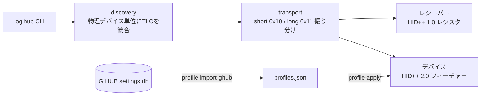

<div align="center">

# better-logihub

### Logicool G HUB の実用機能だけを 3MB の CLI にした Windows 用ツール

[](Cargo.toml)
[](#インストール)
[](LICENSE)

**Electron 201MB + 常駐エージェント 84MB は要らない。マウス設定は HID++ を直接叩けば終わる。**

---

</div>

## 概要

Logicool G HUB は DPI とポーリングレートを変えるためだけに 1.4GB のディスクと複数の常駐プロセスを要求します。better-logihub は G HUB が内部で使っているのと同じ公開解析済みプロトコル (HID++ 1.0 / 2.0) をレシーバーに直接話しかけることで、同じ操作を単体の CLI バイナリで行います。常駐なし、Electron なし、管理者権限なし。

G HUB の設定データベースからプロファイル (DPI テーブル・レポートレート) を取り込めるので、G HUB をアンインストールしても設定は引き継げます。

## 特徴

| 機能 | コマンド | 対応フィーチャー |
|---|---|---|
| デバイス列挙・モデル識別 (レシーバー+ペアリング先) | `logihub list` | HID++ 1.0 レジスタ 0xB5 + 内蔵デバイス表 |
| モデル情報・ライブ機能一覧 | `logihub device-info --device 3` | 内蔵デバイス表 + 0x0001 |
| バッテリー残量・充電状態 | `logihub battery` | 0x1004 / 0x1000 |
| DPI 取得・設定 | `logihub dpi get` / `dpi set 3200` | 0x2202 / 0x2201 |
| レポートレート取得・設定 | `logihub rate get` / `rate set 1000` | 0x8061 / 0x8060 |
| フィーチャーテーブル dump | `logihub features` | 0x0001 |
| 明るさの取得・設定 | `logihub brightness` / `brightness set 50` | 0x8040 |
| ファームウェア RGB エフェクト | `logihub rgb info` / `rgb set ...` | 0x8071 |
| キー単位 RGB フレーム | `logihub perkey set a=FF0000 ...` | 0x8081 |
| G キー情報・software mode | `logihub gkeys info` / `gkeys software-mode on` | 0x8010 |
| M1/M2/M3・MR LED | `logihub mkeys set m1` / `mr on` | 0x8020 / 0x8030 |
| 特殊キー一覧・divert・remap | `logihub keys list` / `keys divert ...` | 0x1B04 |
| HID++ 入力イベント監視 | `logihub watch --device 3` | 0x8010 / 0x8020 / 0x8030 / 0x1B04 |
| G キー・特殊キー常駐割り当て | `logihub daemon` | HID++ 通知 + Windows SendInput |
| ウィンドウなし常駐・自動起動管理 | `logihub daemon install/status/uninstall` | `logihubd.exe` + HKCU\Run(ログオン時起動) |
| 起動時照明・software mode | `logihub startup show/apply/init` | 0x8040 / 0x8071 / 0x8081 / 0x8010 |
| G HUB 設定の完全移行 | `logihub profile import-ghub` | settings.db (SQLite + JSON) |
| プロファイル表示・適用 | `logihub profile show` / `profile apply Desktop` | DPI / rate / 0x8071 / 0x8100 |
| オンボードボタン / G キー割り当て | `logihub onboard set-button` / `set-gkey` | 0x8100 |
| オンボードマクロ作成・一覧 | `logihub onboard macro set` / `macro list` | 0x8100 |
| 起動時 LED スロット | `logihub onboard led show` / `led set` | 0x8100 |
| オンボード JSON export / import | `logihub onboard export` / `import` | 0x8100 |
| オンボード / host mode | `logihub onboard mode get` / `mode set on` | 0x8100 |
| オンボード DPI テーブル / レート | `logihub onboard set-dpi` / `set-rate` | 0x8100 |
| アクティブ DPI スロット固定 | `logihub onboard set-dpi-index 3` | 0x8100 |
| オンボードメモリの dump / restore | `logihub onboard dump` / `restore` | 0x8100 |
| オンボード名の取得・設定 | `logihub onboard get-name` / `set-name` | 0x8100 |
| セクター CRC 取得・保存済みマクロ実行 | `logihub onboard crc` / `exec-macro` | 0x8100 |

- 全コマンド `--json` で JSON 出力対応
- Unifying / LIGHTSPEED / Bolt 各レシーバーと有線直結デバイスに対応する設計
- Windows の HID コレクション分割 (short/long TLC) を正しく処理
- HID++ 2.0 software id は 1〜15 から選び、他ソフトとの衝突を検出すると自動で切り替え

## 処理フロー


```mermaid
flowchart LR
    CLI[logihub CLI] --> D[discovery<br>物理デバイス単位にTLCを統合]
    D --> T[transport<br>short 0x10 / long 0x11 振り分け]
    T --> R[レシーバー<br>HID++ 1.0 レジスタ]
    T --> Dev[デバイス<br>HID++ 2.0 フィーチャー]
    G[(G HUB settings.db)] -->|profile import-ghub| P[profiles.json]
    P -->|profile apply| Dev
```

## インストール

```bash
cargo build --release
# → target/release/logihub.exe と logihubd.exe
# 自動起動を使う場合は 2 ファイルを同じディレクトリに置く
```

## 使い方

```bash
# 接続デバイス一覧
logihub list
logihub list --json

# 内蔵モデル情報と、実機が現在広告している HID++ 機能
logihub device-info --device 3

# バッテリー確認
logihub battery

# DPI を 3200 に (デバイスが複数あるときは --device <番号>)
logihub dpi set 3200 --device 1

# G HUB から設定を移行して内容を確認してから適用
logihub profile import-ghub --dry-run
logihub profile import-ghub
logihub profile show Desktop
logihub profile apply Desktop --device 1

# キーボードの明るさ (割合またはデバイス生値)
logihub brightness --device 3
logihub brightness set 50 --device 3
logihub brightness set raw 500 --device 3

# 対応ゾーン・エフェクト・NV capability・電源モードを表示
logihub rgb info --device 3

# RAM だけに固定色を書き、消灯する (NVM は --persist nvm)
logihub rgb set --zone 0 --effect fixed --color 00FF40 --persist ram --device 3
logihub rgb set --zone all --effect colorwave --period 5000 --direction horizontal --device 3
logihub rgb off --zone all --device 3

# RGB 電源モード。数値の意味は機種依存なので生値として扱う
logihub rgb power --device 3
logihub rgb power set 1 --device 3

# NV 設定の生読み書き (item は 0x0001 等、値は 7 byte)
logihub rgb nv get 0x0001 --device 3
logihub rgb nv set 0x0001 01 00 FF 40 00 00 00 --device 3

# キー単位の色。zone-id の実機確認前は番号方式を必ず明示する
logihub perkey set a=FF0000 b=00FF00 --zone-scheme hidusage --device 3
logihub perkey fill 202020 --zone-scheme hidusage --device 3
logihub perkey frame --from frame.json --zone-scheme hidusage --device 3
logihub perkey clear --zone-scheme hidusage --device 3

# A/B キーに候補ごとの色を書き、観察結果を入力する。方式は自動決定しない
logihub perkey probe --device 3

# G キー数と getPhysicalLayout の raw BE16 値
logihub gkeys info --device 3

# software mode 中は通常の F キー出力が止まる。確認後は必ず off に戻す
logihub gkeys software-mode on --device 3
logihub watch --device 3
logihub gkeys software-mode off --device 3

# M キーと MR の LED
logihub mkeys set m1 --device 3
logihub mkeys set none --device 3
logihub mr on --device 3
logihub mr off --device 3

# reprogrammable control の CID、task、capability、現在の reporting 状態
logihub keys list --device 3
logihub keys list --device 1

# 一時 divert。--persist はデバイスの永続設定を変更するので通常は付けない
logihub keys divert play-pause on --device 3
logihub keys divert play-pause off --device 3
logihub keys divert 0x00c3 on --raw-xy on --device 1
logihub keys divert 0x00c3 off --raw-xy off --device 1

# source CID を target CID の native task へ一時 remap。group/gmask を検証してから送る
logihub keys remap 0x0053 0x0056 --device 1

# 全 CID reporting 設定をファームウェア既定へ戻す
logihub keys reset --device 1

# ボタンにショートカットを割り当て (マウス本体のメモリに書くので常駐ソフト不要)
logihub onboard dump --out backup.bin --device 1   # 書き込み前のバックアップ (必須)
logihub buttons set 7 key:ctrl+c --device 1
logihub buttons set 11 key:win+l --device 1
logihub buttons list --device 1
logihub onboard set-button 7 key:f5 --device 1     # onboard 配下でも同じ操作

# G913 の G キー。通常 bank と G-Shift bank の両方を扱う
logihub onboard set-gkey 1 key:ctrl+shift+c --device 3
logihub onboard set-gkey 2 key:volume-up --gshift --device 3

# オンボードマクロ。key は押下+解放、text は ASCII をキー列へ変換する
logihub onboard macro list --device 3
logihub onboard macro set 3 --device 3 --steps '[{"key":"ctrl+c"},{"delay_ms":100},{"text":"hi"},{"consumer":"volume_up"}]'
logihub onboard macro show 4 0 --device 3
logihub onboard macro clear 3 --device 3

# プロファイルに保存される 4 個の起動時 LED スロット (slot は 0〜3)
logihub onboard led show --device 3
logihub onboard led set 0 --effect fixed --color 00FF40 --device 3
logihub onboard led set 1 --effect colorwave --period 5000 --direction horizontal --device 3

# オンボード / host mode を明示的に確認・変更 (on=onboard、off=host)
logihub onboard mode get --device 3
logihub onboard mode set on --device 3

# 全 sector と decoded profile/macro/LED を JSON 化
logihub onboard export --device 1 --out profile.json
logihub onboard import --device 1 --in profile.json --dry-run  # 常に先に差分確認
logihub onboard import --device 1 --in profile.json --yes      # 差分表示後にだけ書く

# DPI テーブルとレートもオンボード化 (電源を切っても残る)
logihub onboard set-dpi 800 1200 1600 4000 7000 --default 3 --shift 800 --device 1
logihub onboard set-rate 1000 --device 1
logihub onboard set-dpi-index 3 --device 1   # 今使うスロットを指定

# 最初の有効プロファイル名と、セクター CRC を読み取る
logihub onboard get-name --device 1
logihub onboard crc 1 --device 1             # 0x0101 のような 16 進数も可

# プロファイル名を書き換える (事前 dump 必須)
logihub onboard set-name "Desktop" --device 1

# 保存済みオンボードマクロを指定位置から実行
logihub onboard exec-macro 6 0 --device 1
```

### G HUB settings.db の完全インポート

`profile import-ghub` は `data` テーブル内の単一 JSON を読み、プロファイル、アプリケーション、カード参照、ボタン / G キー割り当て、マクロ、DPI、レポートレート、ファームウェア照明をまとめて変換します。既定の入力は `%LOCALAPPDATA%\LGHUB\settings.db`、既定の出力先は `%APPDATA%\better-logihub` です。

```bash
# 書き込みなしで全警告と生成予定ファイルを確認
logihub profile import-ghub --dry-run

# バックアップ DB、出力先、対象機種を明示
logihub profile import-ghub \
  --db C:\backup\settings.db \
  --out-dir C:\backup\converted \
  --device-model g502x-lightspeed

logihub profile list
logihub profile show Desktop

# live 適用: DPI、レポートレート、ファームウェア照明
logihub profile apply Desktop --device 1

# オンボード適用: Phase D と同じ CRC / 差分 / バックアップ検査を通す
logihub profile apply Desktop --device 1 --onboard --yes

# 生成された portable onboard JSON も通常の import 経路で検証・適用できる
logihub onboard import --in converted\onboard\desktop--g502x_lightspeed.json --device 1 --dry-run
logihub onboard import --in converted\onboard\desktop--g502x_lightspeed.json --device 1 --yes
```

出力は次のとおりです。

- `profiles.json`: 既存 schema version 1 を保ち、プロファイル別の割り当て、マクロ、照明を追加
- `bindings.json`: daemon が実行できる G キー / CID の keystroke、text、media、run、macro
- `onboard/*.json`: 対応機種用の DPI index、レート、割り当て、オンボード可能なマクロ、LED スロット
- `rgb/*.json`: `logihub rgb set` の引数として使えるファームウェア照明プリセット

G HUB 組み込みカード ID は DB 内に実体がなくても復号します。`g502x_lightspeed` と `g502x-lightspeed` は同一機種として扱い、`sequences` / `sequence` の両方を受け付けます。device depot にしか存在しない既定割り当て、物理 CID を DB から特定できない入力、layout-A に格納できないアクションは推測せず、unassigned または NOOP として理由を警告します。

プロファイルは `%APPDATA%\better-logihub\profiles.json` に保存されます。

## 常駐割り当て

`logihub daemon` とウィンドウなしの `logihubd.exe` は同じ daemon 実装を使い、既定で `%APPDATA%\better-logihub\bindings.json` を読みます。ファイルがなければ安全な例を作成し、`startup.json` もなければ終了します。`logihubd.exe` はコンソールを開かず、ログを `%APPDATA%\better-logihub\logs\daemon.log` に追記します。約 5 MB で `daemon.log.1` へローテーションします。

自動起動は現在のユーザーの `HKCU\Software\Microsoft\Windows\CurrentVersion\Run` に登録します(管理者権限不要。タスク スケジューラの ONLOGON は管理者が要るため不採用)。対話ユーザーのデスクトップで動くため `SendInput` も利用できます。`install` は実行中の `logihub.exe` と同じディレクトリにある `logihubd.exe` の絶対パスを保存し、`--start` を付けるとその場で起動します。

```bash
logihub daemon install
logihub daemon install --start
logihub daemon status
logihub daemon uninstall

# コンソール上でのテスト実行
logihub daemon --config C:\path\bindings.json --verbose

# resident binary の手動テスト。通常は Run エントリから引数なしで起動する
logihubd --config C:\path\bindings.json --verbose
```

`status` は Run エントリの有無、resident daemon の実行状態、実行ファイル、使用中の設定パス、ログパスを表示します。同名 mutex `Local\better-logihub-daemon` により二重起動は静かに終了します。`uninstall` は Run エントリを削除して named event で daemon に正常終了を要求し、G-key software mode、未解放の一時 DPI shift、daemon が divert した CID を復元します。ログオフ/シャットダウンの `WM_ENDSESSION` とコンソール終了通知でも同じ復元経路を通ります。

### bindings.json

デバイスキーは内蔵データの `model_id` または `0x` 付き PID です。CID は `keys list` に出る数値または名前を指定します。従来の `keys` / `text` / `run` / `macro` / `none` に加え、DPI、オンボードプロファイル、メディア、照明を押下 edge で実行できます。`{"dpi":"shift"}` だけは hold 中の一時 DPI で、release edge に元の DPI へ戻ります。

```json
{
  "devices": {
    "g915": {
      "gshift_key": "g5",
      "gkeys": {
        "g1": { "keys": "ctrl+shift+c" },
        "g2": { "media": "play_pause" },
        "g3": { "brightness": 0 },
        "g4": { "rgb": { "zone": "all", "effect": "fixed", "color": "004080", "persist": "ram" } }
      },
      "gkeys_shifted": {
        "g1": { "text": "定型文" },
        "g2": { "perkey_fill": "000000" }
      },
      "cids": {
        "play-pause": { "keys": "media-play-pause" }
      },
      "apps": {
        "game.exe": {
          "gkeys": {
            "g1": { "profile": "next" },
            "g2": { "dpi": "shift" }
          },
          "gkeys_shifted": {
            "g1": { "dpi": 3200 }
          },
          "cids": {
            "play-pause": { "media": "mute" }
          }
        }
      }
    }
  }
}
```

追加 action の値は次のとおりです。

- `dpi`: `up` / `down` / `cycle` / `shift` / `default` または DPI 数値
- `profile`: `next` / `prev` または 1 始まりのオンボードプロファイル番号
- `media`: `play_pause` / `next` / `prev` / `stop` / `mute` / `vol_up` / `vol_down`
- `rgb`: 後述の startup `rgb` と同じ object
- `brightness`: 0〜100
- `perkey_fill`: `RRGGBB`

`gshift_key` を押している間は `gkeys` の代わりに `gkeys_shifted` を参照します。`apps` は前景ウィンドウの実行ファイル名を約 250 ms ごとに調べ、小文字の exe 名に一致した `gkeys` / `gkeys_shifted` / `cids` だけを base map の上へ重ねます。`--verbose` ではアプリ切り替えも記録します。

### startup.json

`%APPDATA%\better-logihub\startup.json` があれば daemon 起動時とデバイス再接続時に再適用します。`init` は RAM persistence だけを使う例を、既存ファイルを上書きせず作成します。`apply` は daemon を起動せず一度だけ適用する実機テスト用です。

```bash
logihub startup init
logihub startup show
logihub startup apply --device 3
```

```json
{
  "devices": {
    "g915": {
      "brightness": 20,
      "rgb": [
        {
          "zone": "all",
          "effect": "fixed",
          "color": "004080",
          "period_ms": 3000,
          "speed": 20,
          "brightness": 80,
          "direction": "horizontal",
          "persist": "ram"
        }
      ],
      "perkey_fill": "001020",
      "perkey": { "esc": "FF2000" },
      "gkeys_software_mode": false
    }
  }
}
```

`zone` は index または `all`、`persist` は `ram` / `nvm` / `powersave` です。`perkey` と `perkey_fill` は機種データの zone scheme を使います。常用設定で不揮発書き込みが不要なら `ram` のままにしてください。

入力は held mask の変化から判定し、通常 action は押下 edge で一度だけ実行します。キーリピートは行いません。0x1D4B の再構成/電源投入通知では割り当てと startup 設定を再適用します。`watch --json` はイベントごとに 1 JSON object を 1 行で出力します。`logihub daemon --verbose` は stdout、`logihubd --verbose` は `daemon.log` に raw HID++ frame を追加します。

## 制限事項

- 0x8100 layout A (profile format 1〜5) のボタン / G キー、両 G-Shift bank、マクロ、プロファイル名、DPI、レート、LED スロットを扱います。layout B (format 6〜9) は未対応です
- オンボードマクロの `text` は USB HID の US 配列へ確定変換できる ASCII のみです。日本語などの Unicode 文字列は host mode の daemon を使ってください
- `rgb set` の既定は RAM (`--persist ram`)。`nvm` と `powersave` は不揮発領域へ書くため、意図した場合だけ指定してください
- 0x8081 の zone-id は機種ごとに HID usage 方式と Solaar 方式の候補があります。`data/devices.json` に `zone_scheme` がない機種では `--zone-scheme hidusage|solaar` が必須です。`perkey probe` は観察結果を表示するだけで自動保存・自動判定しません
- `perkey frame --from` は `{"a":"FF0000","esc":"00FF00"}` 形式です。`--persist` を付けない限り RAM フレームだけを書きます
- オンボード書き込みは毎回「事前バックアップ必須 → CRC 検証 → 書き込み → GetCRC または読み戻し照合」を通ります。`onboard dump` は directory、全 profile、全 macro sector を保存し、壊れたら `onboard restore` で戻せます
- `onboard import` は書き込み前に sector 単位の差分を必ず表示します。`--dry-run` は一切書かず、実書き込みには `--yes` が必須です
- 電源オフ / スリープ中の無線デバイスは `unreachable` と表示されます (レシーバーの仕様)
- `gkeys info` の physical layout は仕様上「layout id」か「物理 G-key bitmask」か未確定のため、解釈せず raw BE16 として表示します
- `bindings.json` は標準の press/release edge、単純 macro step、G-Shift 1 層を扱う軽量モデルです。M1〜M3、FN ごとの別 assignment map、hold/double-click/toggle/repeat macro は未実装です
- daemon の復元処理は Ctrl+C/console 終了通知、resident の stop event、Windows の logoff/shutdown 通知で動きます。タスクマネージャーの「プロセスの終了」や電源断のようにプロセスへ猶予を与えない強制終了は捕捉できません

## 参考

HID++ プロトコルの公開解析情報 ([Solaar](https://github.com/pwr-Solaar/Solaar)、Linux カーネル `hid-logitech-hidpp`) を参照しています。

## ライセンス

[MIT](LICENSE)
